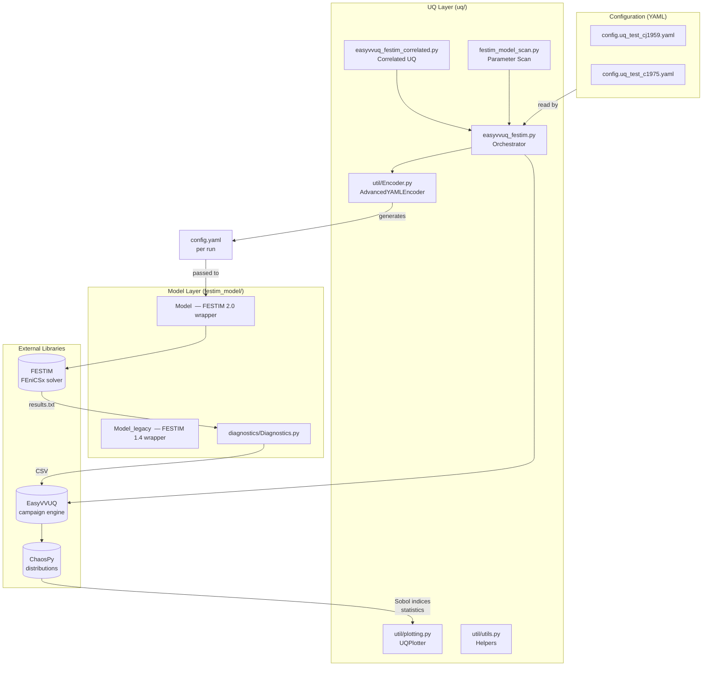
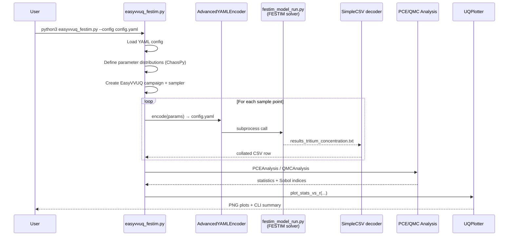

# FESTIM-NIUQ: Non-Intrusive Uncertainty Quantification for Tritium Transport Modelling

> **Conference presentation reference document**
> Author: Yehor Yudin (Bangor University / IPP)

---

## 1. What is FESTIM-NIUQ?

**FESTIM-NIUQ** is a Python package that couples two open-source scientific
frameworks to propagate parametric uncertainties through tritium-transport
simulations of fusion-relevant materials:

| Component | Role |
|---|---|
| [FESTIM](https://github.com/festim-dev/FESTIM) | Finite-element hydrogen/tritium transport solver (built on FEniCSx / DOLFINx) |
| [EasyVVUQ](https://github.com/UCL-CCS/EasyVVUQ) | VVUQ workflow engine (SEAVEA toolkit) |
| [ChaosPy](https://github.com/jonathf/chaospy) | Probability distributions and polynomial chaos expansions |
| FESTIM-NIUQ *(this repo)* | Glue layer: model wrapper, custom encoders/decoders, plotting, diagnostics |

The approach is **non-intrusive**: the underlying FESTIM solver is treated as a
black box and called repeatedly with parameter samples generated by EasyVVUQ.

---

## 2. Application Context

Tritium (radioactive hydrogen isotope) must be carefully accounted for in
fusion reactor components such as a **lithium-ceramic breeder blanket** pebble
bed. The tritium concentration field $c(\mathbf{r}, t)$ is governed by a
diffusion-reaction equation with Arrhenius-type transport coefficients whose
values carry substantial experimental uncertainty.

**Key question addressed by the package:** *Which input parameters drive the
uncertainty in the predicted tritium inventory, and by how much?*

---

## 3. Software Architecture



---

## 4. Key Functionality

### 4.1 Physical Model

The `Model` class (FESTIM 2.0 API) and the `Model_legacy` class (FESTIM 1.4 API)
both wrap the following physical sub-models:

| Sub-model | FESTIM class | Notes |
|---|---|---|
| Tritium transport | `HydrogenTransportProblem` | Fickian diffusion + volumetric source |
| Heat conduction | `HeatTransferProblem` | Optional; coupled or standalone |
| Coupled T–H transport | `CoupledTransientHeatTransferHydrogenTransport` | Fully-coupled transient solver |
| Geometry | `MeshFromVertices` | 1-D; Cartesian, cylindrical, or **spherical** |
| Boundary conditions | `DirichletBC`, `FluxBC`, `ConvectiveFlux` | Configurable per surface and quantity |

### 4.2 Uncertain Input Parameters

The table below lists the six parameters currently treated as uncertain in the
default UQ campaign:

| Symbol | Physical meaning | Unit | Default distribution |
|---|---|---|---|
| $D_0$ | Pre-exponential diffusion coefficient | m² s⁻¹ | Uniform |
| $\kappa$ | Thermal conductivity | W m⁻¹ K⁻¹ | Uniform |
| $G$ | Volumetric tritium generation rate | m⁻³ s⁻¹ | Uniform |
| $Q$ | Volumetric heat source | W m⁻³ | Uniform |
| $E_{kr}$ | Surface recombination activation energy | J mol⁻¹ | Uniform |
| $h_\text{conv}$ | Convective heat-transfer coefficient | W m⁻² K⁻¹ | Uniform |

Distribution parameters (mean and relative standard deviation) are read from the
YAML configuration file, making it straightforward to extend the analysis to
normal, log-normal, beta, gamma, or exponential distributions.

### 4.3 Quantities of Interest (QoIs)

| QoI | Symbol | Dimensionality |
|---|---|---|
| Tritium concentration profile | $c(r)$ or $c(r,t)$ | 1-D (spatial) |
| Total tritium inventory | $I = \int c\,\mathrm{d}V$ | Scalar |
| Temperature profile | $T(r)$ or $T(r,t)$ | 1-D (spatial) |

### 4.4 UQ Methods Supported

| Method | EasyVVUQ class | Suitable for | Output |
|---|---|---|---|
| Polynomial Chaos Expansion (PCE) | `PCESampler` + `PCEAnalysis` | Smooth, differentiable responses; small parameter count | Mean, variance, Sobol indices, full polynomial surrogate |
| Quasi-Monte Carlo (QMC) | `QMCSampler` + `QMCAnalysis` | Non-smooth responses; larger parameter count | Mean, variance, Sobol indices |

Both methods output first- and total-order **Sobol sensitivity indices** for
every grid point, giving a spatially resolved sensitivity map of the tritium
concentration field.

---

## 5. Workflow



### Number of model evaluations

For a PCE of polynomial order $p$ with $N$ uncertain parameters the number of
samples (collocation points) scales as:

$$n_\text{samples} = \binom{N + p}{p}$$

| Order $p$ | $N = 6$ parameters | Notes |
|---|---|---|
| 1 | 7 | Linear approximation, fastest |
| 2 | 28 | Captures quadratic effects |
| 3 | 84 | Full cubic surrogate |

---

## 6. Configuration and Extensibility

All model and UQ settings are centralised in a single **YAML configuration
file** that controls:

- Geometry: domain length, coordinate system (`cartesian` / `cylindrical` /
  `spherical`), mesh resolution
- Materials: $D_0$, $E_D$, $\rho$, $c_p$, $\kappa$ with mean and relative
  standard deviation
- Boundary conditions: type (Dirichlet / Neumann / convective flux), surface,
  value distribution
- Source terms: constant volumetric terms for both tritium transport and heat
  conduction
- Simulation settings: transient or steady-state, time step, solver tolerances,
  output milestone times
- UQ settings: uncertain parameter list, distribution type, polynomial order or
  number of MC samples

The `AdvancedYAMLEncoder` performs deep nested substitution in the YAML template
using a dot-notation path map (e.g.
`"D_0" → "materials.D_0.mean"`), so no Jinja templating of the physics input
file is needed.

---

## 7. Development Facts

| Fact | Detail |
|---|---|
| Language | Python ≥ 3.9 |
| Package name | `festim_niuq` v 0.1.0 |
| Author | Yehor Yudin (Bangor University, y.yudin@bangor.ac.uk) |
| FESTIM versions supported | 1.4 (legacy) and 2.0 (current) |
| HPC execution | SLURM script included (`uq/slurm_scripts/festim_run_hawk.sl`) for Hawk cluster |
| Parallel execution | QCG-PilotJob pool (`QCGPJPool`) for embarrassingly parallel sample evaluation |
| Correlated parameters | `easyvvuq_festim_correlated.py` — supports non-diagonal covariance matrices |
| Parameter scanning | `festim_model_scan.py` — logarithmic or linear scans over single parameters |
| CI | GitHub Actions Pylint workflow |
| Key dependencies | `festim`, `easyvvuq`, `chaospy`, `numpy`, `matplotlib`, `PyYAML`, `joblib` |

---

## 8. Results and Outputs

A successful UQ campaign produces:

1. **CLI summary** — mean, standard deviation, and higher moments of each QoI at
   every mesh node.
2. **Sobol sensitivity index plots** — bar charts and spatial profiles (PNG)
   showing which parameter dominates uncertainty at each radial position.
3. **Statistical profile plots** — mean ± confidence bands of the concentration
   field across the domain.
4. **Pickle archives** — serialised EasyVVUQ results object and campaign
   configuration for post-processing without re-running.

### Example: Sobol index interpretation

```
First-order Sobol index S_i ≈ fraction of total output variance
explained by parameter i alone.

S(D_0) = 0.72  →  diffusion coefficient dominates uncertainty
S(G)   = 0.18  →  generation rate is secondary
S(E_kr)= 0.06  →  surface recombination is minor
...
```

---

## 9. Verification Test Cases

Two verification configurations are bundled with the package:

| File | Physics | Reference |
|---|---|---|
| `config.uq_test_c1975.yaml` | Tritium diffusion in a sphere, Dirichlet outer BC, transient | Internal test (1975-era analytical solution style) |
| `config.uq_test_cj1959.yaml` | Tritium diffusion in a sphere, constant volumetric source, Dirichlet outer BC, transient | Carslaw & Jaeger 1959 analytical benchmark (*"Conduction of Heat in Solids"*) |

Both use a 1024-element spherical mesh, adaptive time stepping, and 14 milestone
output times from 0.1 s to 1024 s.

---

## 10. Quick-Start Summary

```bash
# 1. Create and activate environment
conda create -n festim-env
conda activate festim-env
conda install -c conda-forge festim=2.0.a8
pip install easyvvuq chaospy

# 2. Run the default UQ campaign
cd uq
python3 easyvvuq_festim.py

# 3. Run with a custom configuration
python3 easyvvuq_festim.py --config config/config.uq_test_cj1959.yaml

# 4. Run a parameter scan
python3 festim_model_scan.py

# 5. Run with correlated parameters
python3 easyvvuq_festim_correlated.py
```

---

*Generated for conference presentation purposes.*
