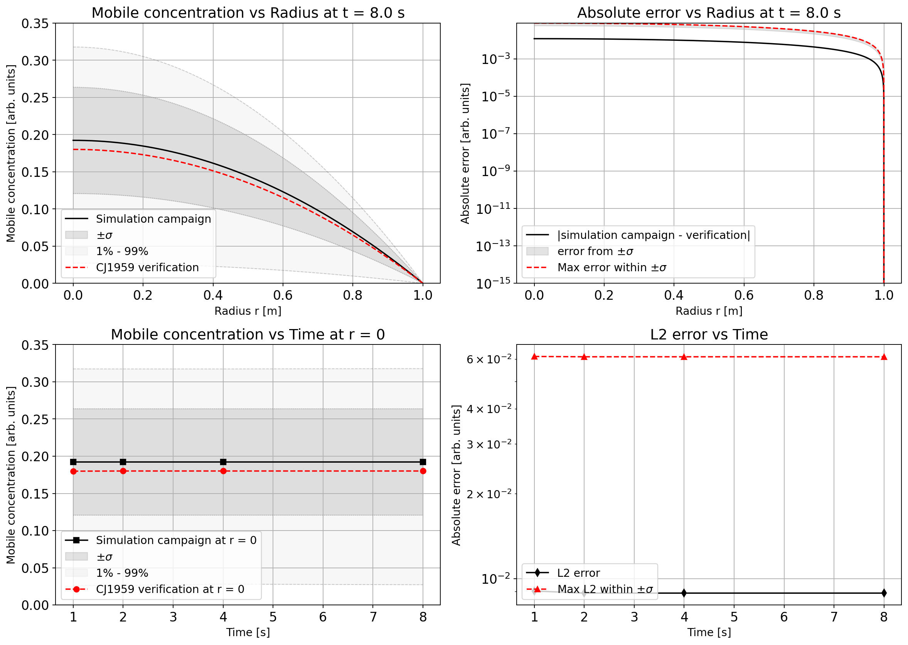
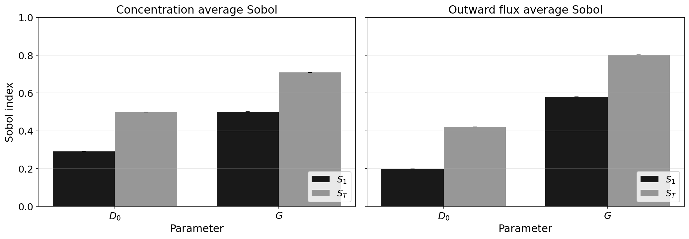
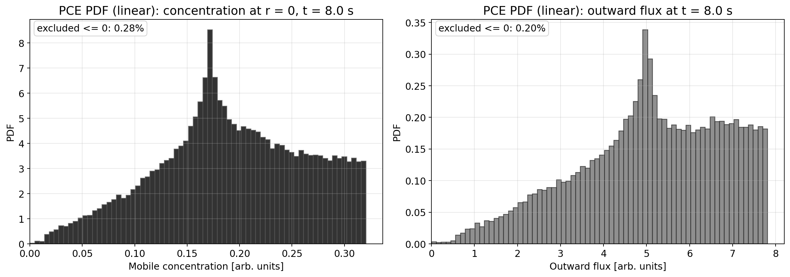

# Summary

Tritium is a crucial fuel component of future fusion power plants.
Owing to its radioactivity, it is also of critical safety importance, and its inventory in fusion power plants must be strictly monitored.
Accurate predictions of tritium transport through fusion reactor components, such as breeder blankets and plasma-facing components, are essential for ensuring sufficient fuel cycle performance, monitoring its efficiency, and assessing safety and reactor design.
However, the material transport coefficients governing these predictions are subject to substantial experimental uncertainty, and their ab initio estimates may also contain uncertainties that must be accounted for.

*FESTIM-NIUQ* is a Python package that automates non-intrusive uncertainty quantification (NIUQ) for tritium transport simulations performed with the *FESTIM* (Finite Elements Simulation of Tritium in Materials) framework [@festim2026github; @delaporte2019festim; @dark2026festim].
The package couples *FESTIM* with *EasyVVUQ* [@richardson2020easyvvuq] and ChaosPy [@feinberg2015chaospy] to propagate parametric uncertainties through diffusion–reaction models of tritium behaviour in fusion-relevant materials.
The user can specify probability distributions for input parameters, including the diffusion pre-exponential factor, thermal conductivity, volumetric tritium generation rate, and tritium surface recombination energy, as well as other parameters for possible different species.
Given this specification, *FESTIM-NIUQ* automatically generates parameter samples, executes *FESTIM* simulations in parallel, and computes statistical moments and Sobol sensitivity indices [@sobol1993sensitivity; @sobol2001global] of quantities of interest, including spatially resolved concentration profiles and integral tritium inventories.  
The entire workflow is controlled by a single *YAML* configuration file, which specifies model equations and theoretical terms, geometry and boundary conditions, as well as parameter values, both deterministic and uncertain, making it accessible to fusion materials scientists who have no prior UQ expertise.

The *0.2.0* version of the package is available as source code on *GitHub*, installable from the *PyPI* repository, and is archived at *Zenodo*.
The repository covers basic functionality with unit tests, provides several verification cases, and allows users to adapt it to specific needs under a permissive MIT license.

The repository page contains a mini-wiki to track functionality, numerical details, etc., a project page for future plans, and a discussion page.

# Statement of Need

Tritium must be carefully inventoried and managed in fusion reactor components due to its radioactivity, scarcity, and role as a fuel.
Fusion reactor components, such as tungsten and beryllium first walls, interact with tritium over long operational periods.
Tritium transport is governed by a coupled diffusion-reaction system with Arrhenius-type coefficients whose values are often measured with uncertainties of tens of per cent [@causey2012tritium].
Reliable safety assessments and design decisions require an understanding of how uncertainties in these inputs propagate into predicted tritium inventories and release rates [@longhurst2011verification].
Analysis that targets design and prediction should provide confidence intervals in addition to the mean estimates for tritium inventory and release rates, since these directly affect safety licensing [@mirallesdolz2024uncertainty].

## Gap in Existing Tools

Although general-purpose UQ frameworks exist (see *State of the Field* below), coupling any of them to a finite-element tritium transport solver requires non-trivial engineering: writing a solver-specific parameter encoder, an output decoder, a subprocess execution harness, and post-processing and plotting utilities.
This barrier is high enough that most published tritium transport studies report only deterministic results at nominal parameter values, forgoing systematic UQ entirely.

*FESTIM-NIUQ* removes the barrier to UQ applications in the *FESTIM* user community [@delaporte2024festim] by providing a ready-to-use pipeline that handles every step from a *YAML* configuration file to publication-quality sensitivity-index plots.
The package is designed to be extended: new uncertain parameters, boundary conditions, or coordinate geometries are added by editing the configuration file rather than modifying the Python source code.
<!--*FESTIM-NIUQ* has been used in ongoing research at the Nuclear Futures Institute, Bangor University, to assess parametric uncertainties in lithium-ceramic breeder blanket tritium transport simulations, and it has been presented at the UKAEA Technical Meeting [@ukaea2026meeting] and the Open-Source Software for Fusion Energy Workshop (OSSFE 2026) [@ossfe2026]. -->

Verification of the solver wrapper has been performed against Carslaw and Jaeger's analytical solutions for diffusion in a sphere [@carslaw1959conduction], and convergence of the Polynomial Chaos Expansion (PCE) surrogate has been studied.

<!-- confirmed with increasing polynomial order. -->

<!-- [TODO: add PCE scaling study] -->

\autoref{fig:pce_p_order} demonstrates the dependency of the computed mean, standard deviation, and Sobol indices (partial variance due to variation of a single parameter or subset of parameters) on the polynomial order employed in the PCE study.
Here, a Smolyak sparse grid is used for a quadrature-based sample [@bungartz2004sparse].
The problem solved is a constant source, zero initial condition, homogenous Dirichlet BC, and diffusion in spherical coordinates [@carslaw1959conduction].

{#fig:pce_p_order}

# State of the Field

Several general-purpose UQ frameworks exist, including *Dakota* [@adams2021dakota], *OpenTURNS* [@baudin2017openturns], *UQLab* [@marelli2014uqlab], *SALib* [@herman2017salib], and *ChaosPy* [@feinberg2015chaospy].
While powerful, these tools require users to write bespoke glue code, which includes parameter encoders, solver wrappers, and output decoders for each specific solver, which is a significant effort for finite-element tritium transport problems.
<!-- involving nested *YAML* configurations, *VTX* result files, and subprocess execution. -->
Each of the specific hydrogen and tritium transport frameworks, alternative codes including *TMAP8* [@simon2025tmap8], *TESSIM-X* [@schmid2012tessim], *SAETTA* [@hattab2025saetta] and *HIIPC* [@sanghiipc], each with different physical scope, model specifics and assumptions, numerical backend, and input formats.
They would require adapting UQ tools for the specific use case.
However, the experience of applying generic UQ methods for hydrogen/tritium transport provides a pathway to adopting these methods in the field.

*EasyVVUQ* [@richardson2020easyvvuq] from the SEAVEA Toolkit provides a flexible VVUQ workflow engine and reduces this burden, but the user must still implement solver-specific encoder and decoder classes.
*FESTIM-NIUQ* fills this niche by providing pre-built *YAML*-based encoders with deep nested parameter substitution via dot-notation paths, *CSV* decoders, a subprocess execution harness, and publication-quality plotting routines, all tailored to the *FESTIM* data model.
The result is that a user can launch a complete UQ campaign with a single command and configuration file without writing any Python code.

Contributing a generic *FESTIM* integration upstream to *EasyVVUQ* was considered but rejected because the integration requires *FESTIM*-specific knowledge of its configuration schema, output file formats, and coordinate-system conventions.
Maintaining it as a standalone package allows independent versioning aligned with *FESTIM* releases and keeps the *EasyVVUQ* core free of solver-specific logic.
\autoref{tab:functionality} summarises the capabilities provided by the package.

<!-- [TODO: table summary of existing tools: FESTIM integration, PCE support, YAML config, fusion-specific QoIs] -->

: Overview of the functionality implemented in *FESTIM-NIUQ*. \label{tab:functionality}

+----------------------------+---------------------------------------------------------+--------------------------------+
| **Functionality**          | **Package support**                                     | **Status**                     |
+============================+=========================================================+================================+
| *FESTIM* integration       | Wrapper for *FESTIM* **2.0** (*Model*), legacy          | Implemented,                   |
|                            | *FESTIM* **1.4** (*Model_legacy*).                      | updates considered             |
+----------------------------+---------------------------------------------------------+--------------------------------+
|                            |                                                         |                                |
+----------------------------+---------------------------------------------------------+--------------------------------+
| Physics model types        | *tritium_transport* (hydrogen/tritium transport),       | Implemented (coupled           |
|                            | *heat_transport*, and transient coupled                 | transient path present)        |
|                            | heat+tritium model.                                     |                                |
+----------------------------+---------------------------------------------------------+--------------------------------+
|                            |                                                         |                                |
+----------------------------+---------------------------------------------------------+--------------------------------+
| Dimensionality / geometry  | 1D implementation, coordinate systems:                  | 1D implemented; 2D/3D requires |
|                            | **cartesian / cylindrical / spherical**.                | manual adaptation              |
+----------------------------+---------------------------------------------------------+--------------------------------+
|                            |                                                         |                                |
+----------------------------+---------------------------------------------------------+--------------------------------+
| Mesh                       | Regular and refined 1D meshes                           | Implemented                    |
|                            | (**linear/quadratic refinement** options).              |                                |
+----------------------------+---------------------------------------------------------+--------------------------------+
|                            |                                                         |                                |
+----------------------------+---------------------------------------------------------+--------------------------------+
| Boundary conditions        | Concentration: *dirichlet*, *neumann*,                  | Implemented                    |
|                            | *surface_reaction*; Temperature: *dirichlet*,           |                                |
|                            | *neumann*, *convective_flux*, *radiative_flux*,         |                                |
|                            | *combined_flux*.                                        |                                |
+----------------------------+---------------------------------------------------------+--------------------------------+
|                            |                                                         |                                |
+----------------------------+---------------------------------------------------------+--------------------------------+
| Source terms               | Concentration **particle** source and                   | Implemented, constant sources  |
|                            |  **heat** source.                                       |                                |
+----------------------------+---------------------------------------------------------+--------------------------------+
|                            |                                                         |                                |
+----------------------------+---------------------------------------------------------+--------------------------------+
| Uncertain parameters       | Parsed uncertain candidates: $D_0$, $\kappa$, $G$,      | Implemented                    |
|                            | $Q$, $E_{kr}$, $h_{conv}$ (from *YAML*:                 |                                |
|                            | *mean*, *relative_stdev*, *pdf*).                       |                                |
+----------------------------+---------------------------------------------------------+--------------------------------+
|                            |                                                         |                                |
+----------------------------+---------------------------------------------------------+--------------------------------+
| Parameter distributions    | Lookup includes **uniform**, **normal**,                | Implemented                    |
|                            | **log-normal**, **beta**, **gamma**, **exponential**.   |                                |
+----------------------------+---------------------------------------------------------+--------------------------------+
|                            |                                                         |                                |
+----------------------------+---------------------------------------------------------+--------------------------------+
| Correlated-parameter UQ    | Correlated workflow via multivariate normal             | Specialised script;            |
|                            | (*Rosenblatt/Cholesky*-style handling), currently       | needs further support          |
|                            | for $D_0$ + *thermal_conductivity*.                     |                                |
+----------------------------+---------------------------------------------------------+--------------------------------+
|                            |                                                         |                                |
+----------------------------+---------------------------------------------------------+--------------------------------+
| PCE support                | *PCESampler* + *PCEAnalysis*; Sobol first/total         | Implemented; Bayesian          |
|                            | indices, moments, quantiles.                            | surrogate utilisation underway |
+----------------------------+---------------------------------------------------------+--------------------------------+
|                            |                                                         |                                |
+----------------------------+---------------------------------------------------------+--------------------------------+
| qMC support                | *QMCSampler* + *QMCAnalysis*; in main EasyVVUQ          | Implemented, in main UQ flow   |
|                            | workflow (*uq_scheme: qmc*).                            |                                |
+----------------------------+---------------------------------------------------------+--------------------------------+
|                            |                                                         |                                |
+----------------------------+---------------------------------------------------------+--------------------------------+
| Other UQ modes             | Correlated script supports **FD** and **PCE**;          | Under manual testing           |
|                            | **Bayesian inverse UQ** via PCE surrogate +             |                                |
|                            | MCMC (`emcee`).                                         |                                |
+----------------------------+---------------------------------------------------------+--------------------------------+
|                            |                                                         |                                |
+----------------------------+---------------------------------------------------------+--------------------------------+
| *YAML* configuration       | Full workflow controlled by *YAML* (model + solver +    | Implemented                    |
|                            | UQ parameter definitions); deep nested substitution     |                                |
|                            | via *AdvancedYAMLEncoder* dot-path mapping.             |                                |
+----------------------------+---------------------------------------------------------+--------------------------------+
|                            |                                                         |                                |
+----------------------------+---------------------------------------------------------+--------------------------------+
| Fusion-specific QoIs       | *tritium_concentration* profiles (**steady/             | Implemented; differences       |
|                            | transient** checkpoints), *total_tritium_release*,      | between legacy and             |
|                            | *total_tritium_trapping*, *tritium_inventory*.          | current implementation         |
+----------------------------+---------------------------------------------------------+--------------------------------+
|                            |                                                         |                                |
+----------------------------+---------------------------------------------------------+--------------------------------+
| Outputs for UQ             | Profile file (*results_tritium_concentration.txt*)      | Implemented                    |
|                            | for campaign decoding; scalar outputs                   |                                |
|                            | (*output.csv* / summary *CSV*) for scalar QoIs.         |                                |
+----------------------------+---------------------------------------------------------+--------------------------------+
|                            |                                                         |                                |
+----------------------------+---------------------------------------------------------+--------------------------------+
| Visualisation              | Profiles for solution quantities vs. time and space;    | Implemented; HTML dashboard    |
|                            | std. deviation, quantiles, Sobol index profiles;        | for individual jobs underway   |
|                            | colour plots, verification comparisons,                 |                                |
|                            | UQ convergence studies.                                 |                                |
+----------------------------+---------------------------------------------------------+--------------------------------+

<!-- [TODO: Cite UQ studies on hydrogen transport that used manual/ad-hoc methods to further motivate automation.] -->

One alternative approach to tritium transport modelling is to apply the *Stochastic Tools Module* [@slaughter2023moose] to the *TMAP8* code [@simon2025tmap8].
This approach requires utilising the *MOOSE* framework for the entire workflow, including uncertainty analysis, physics simulation, surrogate training, and sensitivity analysis.

# Software Design

*FESTIM-NIUQ* adopts a non-intrusive architecture.
In this way, the *FESTIM* solver is treated by a UQ algorithm as a black box.
This design decouples the UQ layer from the solver internals, allowing users to upgrade *FESTIM* independently and to apply the same UQ machinery to different transport models without code changes.

The package consists of three layers:

1. **Model wrapper** (`festim_model/`): Encapsulates *FESTIM* model configuration, execution, and result export for both *FESTIM* 2.0 (*DOLFINx*-based [@baratta2023dolfinx]) and the legacy *FESTIM* 1.x API.
The model is constructed out of the following elements: geometry, mesh, material properties, boundary conditions, and solver settings.
2. **UQ orchestration** (`uq/`): Manages parameter sampling, campaign execution, and analysis using *EasyVVUQ* and *ChaosPy*.
Contains encoder/decoder classes to access generic *FESTIM* models.
Supports Polynomial Chaos Expansion (PCE), Quasi-Monte Carlo (qMC), and Bayesian inverse UQ via PCE surrogate and MCMC.
3. **Utilities** (`uq/util/`): Custom *YAML* encoders that perform deep nested parameter substitution via dot-notation paths, *CSV* decoders, and publication-quality plotting routines for Sobol indices and statistical profile bands.

The `AdvancedYAMLEncoder` replaces parameter values at arbitrary nesting levels in *YAML* configuration files without requiring `Jinja` templates, thereby simplifying the workflow and reducing the risk of template syntax errors.
Support for correlated parameters is provided via Cholesky decomposition of user-specified covariance matrices.

For high-performance computing environments, *FESTIM-NIUQ* integrates with *QCG-PilotJob* to enable embarrassingly parallel sample evaluation on cluster resources, and includes *SLURM* submission scripts for common HPC platforms.  
On workstations, the same campaign runs locally using `joblib` multiprocessing without any configuration changes, ensuring reproducibility across environments.

## Configuration Interface

All UQ settings are controlled through a *YAML* configuration file, as the example in this section indicates.

<!-- \autoref{lst:yaml} -->
<!-- : Example UQ configuration (*config.uq.yaml*). \label{lst:yaml} -->

```yaml
parameters:
  D:
    type: Uniform
    lower: 1.5e-8
    upper: 3.5e-8     # m^2/s - diffusion coefficient
  G:
    type: Uniform
    lower: 8.0e19
    upper: 1.2e20     # /m^3/s - volumetric generation rate
  C_boundary:
    type: Uniform
    lower: 1.0e20
    upper: 5.0e20     # /m^3 - boundary concentration

uq:
  method: pce         # pce, qmc
  polynomial_order: 3
  qoi: tritium_inventory

festim:
  script: festim_model/model.py
```

For any scalar parameter, the user can specify it as uncertain by adding sub-items that specify the uncertainty distribution type and its numerical parameters (bounds, mean, standard deviation).
The model parser recognises parameters as uncertain and tracks them for further UQ studies.
Furthermore, the user can specify the type of UQ analysis to be performed and its parameters (number of samples, polynomial order, quantities to study).

# Supported UQ Methods

A number of non-intrusive parametric uncertainty quantification methods implemented in *EasyVVUQ* are supported by the package.

  - **Polynomial Chaos Expansion (PCE)**: Requires $\mathcal{O}(p^d)$ model evaluations for polynomial order $p$ and $d$ uncertain parameters (there is a $\binom{p+d}{d}$ method for sparse version).
  Yields analytical Sobol decomposition from the PCE coefficients [@saltelli1995about].
  - **Quasi-Monte Carlo (qMC)**: Uses Sobol sequences for low-discrepancy sampling.
  Suitable for high-dimensional or computationally inexpensive models.

The data and the fitted UQ model can serve as a surrogate for the solution of the original problem in subsequent methods.
At the moment, inverse Bayesian UQ using PCE surrogates is in implementation.
Furthermore, a UQ method based on Rosenblatt and Cholesky methods with Finite Difference formulation [@kardos2025sensitivity] is in preparation.

## Testing and Continuous Integration
<!-- 
[Describe the GitHub Actions CI pipeline, unit test coverage fraction, and any regression/verification tests. 
Reference the *github/workflows* directory.] -->

The package presents a comprehensive set of tests of different types: unit tests, regression tests, tests for scientific logic, and verification cases.

Testing is covered by Continuous Integration (CI) logic implemented using *GitHub* workflows, which triggers test execution on each push to the main and master branches of the repository's origin.
The tests are executed for three Python versions (3.9, 3.10, 3.11, 3.12).
The testing workflow is complemented by code inspection and linting using *Pylint*.

There are 113 unit tests for basic functionality, seven tests for scientific logic, and two regression tests.
The tests consider possible failure modes in executing a UQ campaign, including failures of individual simulation runs, and test edge cases such as division by zero at the centre of a sample at $R=0$.

The verification cases include Method of Exact Solutions (MES) for a diffusion problem, with two cases presented:

  - Diffusion in spherical coordinates with a constant source, homogeneous Dirichlet boundary conditions, and zero initial conditions. The solution for simplified mobile concentration build-up in a grain is presented in [@carslaw1959conduction].
  - Diffusion in spherical coordinates with a zero source, homogeneous Dirichlet boundary conditions, and constant initial condition for concentration. The solution for a simplified annealing problem is presented in [@crank1975mathematics].

The testing suite implements more complex analyses of mesh convergence, as well as of accuracy and convergence in computing Sobol indices using the PCE method.

# Overall Workflow

\autoref{fig:workflow} illustrates the end-to-end UQ pipeline.
At a high level, *FESTIM-NIUQ* performs five steps:

  1. **Campaign setup**: Parse a *YAML* configuration file specifying uncertain parameters, their probability distributions, the sampling strategy, and the *FESTIM* model entry point.
  2. **Ensemble generation**: Use EasyVVUQ to build a parameter ensemble. Instantiate one *FESTIM* input deck per sample and populate the individual run directories with varied files and links to shared files, mapping them to the original sampling plan.
  3. **Simulation execution**: Run the ensemble sequentially (PC) or in parallel on an HPC cluster via the *SEAVEA Toolkit* [@groen2021vecmatk].
  4. **Post-processing**: Collect outputs, compute statistical moments (mean, variance) and Sobol sensitivity indices for the selected quantity of interest (QoI).
  Save the results of the campaign as a SQLite database of runs and a Pickle file of uncertainty analysis results.
  5. **Reporting**: Print moments to the CLI and write publication-ready Sobol index figures.

{#fig:workflow}

# Example Application

<!-- ## Test Case: Tritium Inventory in a 1-D Slab -->
## Test Case: Tritium Inventory in an isotropic kernel: 1-D spherical geometry

We consider a 1-D ceramic ball of radius $R$ subject to a volumetric tritium source and a fixed concentration boundary condition at $L$: $c_{m}(r = R) = const$.
<!-- The diffusion coefficient of gas in the materials is constant $D$. -->
<!-- $L = 2\,\mathrm{mm}$ -->
The governing transport equation is:

\begin{equation}\label{eq:transport}
\frac{\partial c_{m}}{\partial t} = \nabla\cdot(D\,\nabla c_{m}) - \sum_i \left( k_i^+\,c_{m}\,(n_i - c_{t,i}) - k_i^-\,c_{t,i} \right) + \sum_j G_j
\end{equation}

where $c_{m}$ is the mobile hydrogen concentration, $D$ the diffusion coefficient, $G_j$ the generation rates for different sources of hydrogen, and $c_{t,i}$, $k_i^\pm$, $n_i$ are trap occupancy, rate constants, and density for trap site $i$.

Here, in \autoref{eq:transport}, we take a single species of hydrogen (tritium), homogenous BC $C(r=R)=0$, constant tritium generation $G$, constant isotropic diffusion coefficient $D$, and no trapping.
Diffusion is a function of temperature $T$ via Arrhenius law $D(T) = D_0 \exp( \frac{E_a}{k_B T} )$, where $D_0$ is diffusion coefficient prefactor, $E_a$ is activation energy, $k_B$ is the Boltzmann constant.
Spherical coordinates are used, hence differential operator in form $\nabla \cdot (D \nabla C) = D ( \frac{\partial^{2} C}{\partial r^{2}} + \frac{2}{r} \frac{\partial C}{\partial r} )$.


<!-- Three parameters are treated as uncertain (uniform distributions): $D$, $G$, and $C(r=L)$. -->
<!-- A PCE of order 3 requires $\binom{3+3}{3} = 20$ FESTIM evaluations to resolve. -->
Two parameters are treated as uncertain with uniform distributions (coefficient of variation equal to $0.1$): $D$, $G$.
A PCE study of order 3 with sparse grids requires $\binom{3+2}{2} = 10$ *FESTIM* evaluations to resolve.

## Results

The section illustrates an example of a PCE study with polynomial order $p=3$, a sparse Smolyak quadrature sample, and with uniformly distributed uncertain parameters (coefficient of variation $=0.1$).
\autoref{fig:results_uncertainty} shows the first-order and total-order Sobol indices and the probability density function of the tritium inventory.
\autoref{fig:sobol} demonstrates Sobol indices of total tritium concentration and outward flux for source term and diffusion coefficient values.
\autoref{fig:histogram} indicates a detailed statistics of the selected QoIs using a PCE surrogate.
\autoref{tab:moments} summarises the statistical moments for the mobile concentration.

  {#fig:results_uncertainty}

  {#fig:sobol}

  {#fig:histogram}

  <!-- ![UQ results for the 1-D tungsten slab test case. [TODO: Update captions with actual quantitative findings]](figures:a.png){#fig:results} -->

: Statistical moments of the tritium transport quantities of interest. \label{tab:moments}

| Statistic                | Value | Units     |
|--------------------------|:-----:|:---------:|
| Mean $\mu(C_{m})$               | $1.92 \cdot 10^{-1}$ | arb. un. ($m^{-3}$) |
| Std. deviation, $\sigma(C_{m})$ | $7.14 \cdot 10^{-2}$ | arb. un. ($m^{-3}$) |
| Coefficient of variation | $0.372$  |   --   |
| | |
| Mean $\mu(\Phi_{m})$               | $5.08$ | arb. un. ($m^{-2} s^{-1}$) |
| Std. deviation, $\sigma(\Phi_{m})$ | $1.71$ | arb. un. ($m^{-2} s^{-1}$) |
| Coefficient of variation | $0.336$  |   --   |
<!-- | Mean $\mu$               | todo  | $m^{-3}$  |
| Std. deviation, $\sigma$ | todo  | $m^{-3}$  |
| Coefficient of variation | todo  |   --      | -->

# Research Impact Statement

*FESTIM-NIUQ* was developed as part of ongoing fusion materials research at the Nuclear Futures Institute at Bangor University.
It is part of *TRIMAX*, Tritium Reaction Integrated Multiphysics Analysis eXperiment, an initiative to create a multiscale, multiphysics, uncertainty-aware modelling suite for tritium breeding and tritium-exposed materials.
This initiative is a part of the UKAEA LIBRTI programme on breeder blanket technology.

The code is used to assess parametric uncertainties in tritium transport simulations of lithium ceramic breeder blankets.
The immediate results are used to inform downstream high-fidelity simulations with TRIMAX on sensitivities to a wide spectrum of independent parameters and form a prior belief on the uncertainties of the crucial quantities, allowing for quick specification of the model, frictionless performance of parametric studies, and updating information on uncertain parameters.

The work has been presented at the LIBRTI 2026 Conference on Breeder Blanket Technology [@yudin2026librti] and the Open Source Software for Fusion Energy 2026 conference [@yudin2026ossfe].
<!-- and SEAVEA summer hackathon 2025 [@seaveahack2026] -->
Work on the package began during the summer 2025 SEAVEA hackathon [@seavea2025hack].
The software forms the basis for uncertainty-aware studies of tritium trapping and release in Lithium ceramics irradiation experiments at High Flux Accelerator-Driven Neutron Facility [@bishop2024hfadnef] at the University of Birmingham, a partner project of UKAEA.
<!-- [TODO: future publications] -->
The work performed using this package is in preparation for publication in academic journals on fusion engineering and material science.
Furthermore, the work using the package is accepted for a contributed talk at the International Conference on Computational Science 2026 [@yudin2026iccs26].

<!-- [TODO: GitHub activity] -->

# AI Usage Disclosure

Agentic AI tools (GitHub Copilot, including the copilot-swe-agent) were used during the development of *FESTIM-NIUQ*.
AI assistance was employed to implement additional functionality, automate testing, document, and scaffold the project after the authors developed the initial core software.
All AI-generated code and documentation were reviewed and validated by the human authors for correctness and scientific accuracy.
AI tools (Claude Sonet and Opus 4.7) were used to prepare, brainstorm, draft, and review the manuscript text.

# Acknowledgements

This work was carried out at the Nuclear Futures Institute, Bangor University.  
The work is funded by the UKAEA LIBRTI programme as a feeder stream project.
The authors thank the *FESTIM* development team for their open-source code and responsive support, and the members of the SEAVEA consortium for maintaining the VVUQ toolkit used in this work.

# References
